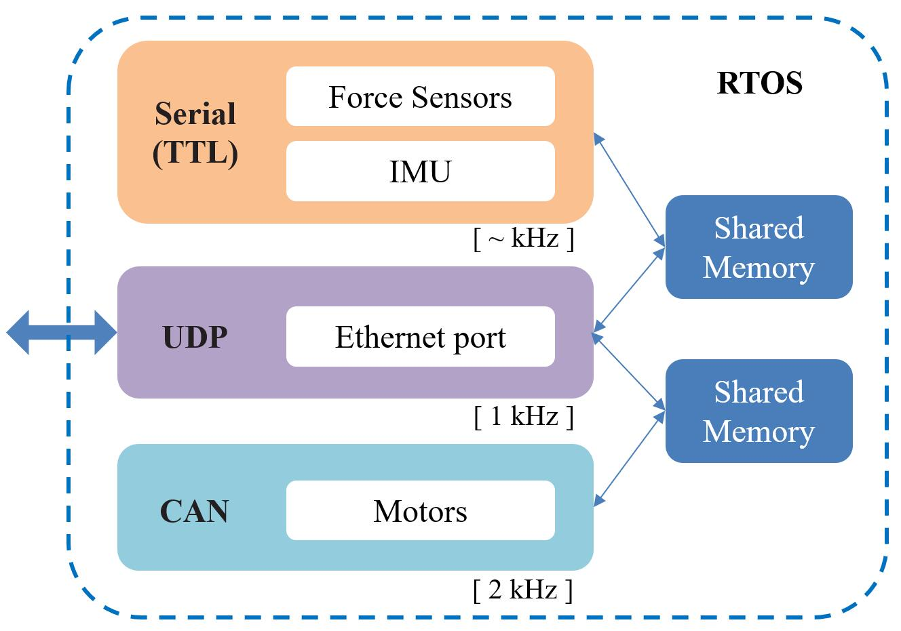
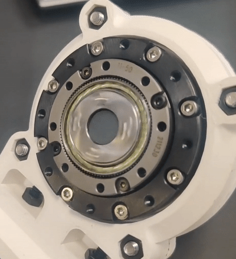
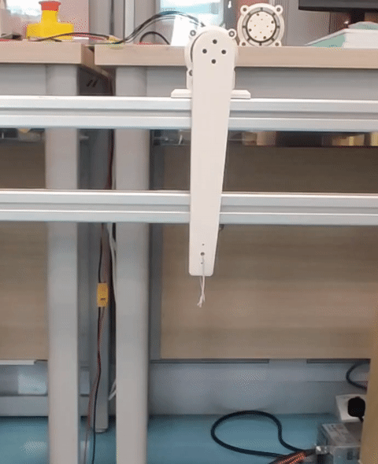

<div align="center">

# Caracal_Teensy
</div>

<div align="center">

</div>

## Introduction #
This repository functions as a hardware bridge between high-level controllers with Ethernet Ports and [GYEMS-RMD](http://www.gyems.cn/product.html) motors with CAN BUS Protocol. You can directly send torque commands to up to 9 motors and receive feedback data, such as position, velocity and actual torque. In the future, other sensor data will be also intergrated here in the same way.

* `1_Motor_CAN` : CAN BUS protocol of motors to write command and read data
* `2_Motor_CAN_UDP` : ~, UDP protocol to communicate with high-level controllers
* `3_Motor_CAN_UDP_RTOS` : ~, real-time system to schedule tasks
* `demo` : example codes of high-level control (C/C++, MATLAB, Python)
* `doc` : figures
* `tutorial` : Arduino offical tutorials

## Hardware #
* [Teensy 4.1](https://www.pjrc.com/store/teensy41.html) - 600MHz, 8 serial, 3 SPI, 3 I2C, 3 CAN BUS, an Ethernet 10/100 Mbit

* Carrier Board - [Official](https://copperhilltech.com/teensy-4-1-triple-can-bus-board-with-240x240-lcd-and-ethernet/) or Self-customized

<div align="center">


</div>

## Dependencies #
* IDE - [PlatformIO](https://www.youtube.com/watch?v=JmvMvIphMnY)

* IDE Setup - [Teensyduino](https://www.pjrc.com/teensy/tutorial.html)

* CAN BUS - [FlexCAN_T4](https://github.com/tonton81/FlexCAN_T4)

* UDP - [NativeEthernet](https://github.com/vjmuzik/NativeEthernet), [FNET](https://github.com/vjmuzik/FNET)

* RTOS - [FreeRTOS-Teensy4](https://github.com/juliandesvignes/FreeRTOS-Teensy4)

## How to run #
Here we take a laptop with Ubuntu 18.04 as a high-level controller. In principle the code is independend of the environment, so both Windows and Linux should be OK (not yet been tested).

**1)** Clone this repository on your laptop. If you are using `GYEMS-RMD L7015-10T` motors, you can directly build the Arduino project in `3_Motor_CAN_UDP_RTOS` folder and then upload to Teensy; otherwise, configure correct [torque constant](https://github.com/Jarvis861/Caracal_Teensy/blob/68ac30157ff4010556ba0d79196818360fe799db/3_Motor_CAN_UDP_RTOS/lib/RMD_Motor/RMD_Motor.hpp#L9-L11) and [reduction ratio](https://github.com/Jarvis861/Caracal_Teensy/blob/68ac30157ff4010556ba0d79196818360fe799db/3_Motor_CAN_UDP_RTOS/lib/RMD_Motor/RMD_Motor.cpp#L34) first.

**2)** Connect all devices physically.

**3)** Configure your laptop's local IP as the following recommended settings once the wired network is indetified.
```
IPv4 - Manual
Address: 192.168.137.178
Netmask: 255.0.0.0
```

**4)** Compile and run the high-level example in `demo/udp_c` folder. 
```
sudo gcc client.c -o client -lm
./client
```
For the permission error, run
```
cd ..
sudo chmod u+x ./udp_c -R
```

**5)** Plot test results
```
./plot_result.py
```
Delete the last incomplete line in `actuator_data.txt` if you meet the error `IndexError: list index out of range`.

You can also find **Matlab** version of the high-level code. However, Matlab cannot run in real time without specific hardware so be careful to use it :-)

## Control Examples
**1)** Gravity Compensation
<div align="center">

</div> 

**2)** Position Control
<div align="center">

</div> 

**3)** Energy Shaping Control (Inverted Pendulum)
<div align="center">

</div> 
<div align="center">

</div> 

* From left to right: Running Actuator; Step Response; Gravity Compensation; Position Control

<div align="center">




</div>

## CAN BUS
The code supports GYEMS-RMD motors with CAN ID `0x141`, `0x142`, `0x143` which means that you must configure the motor ID to 1, 2, 3 by GYEMS software `RMD V2.0.exe` before starting to control motors.

* The tx message `joint command` only includes designed torque information which takes up 48 bytes.
```
float tau_a_des[3];
float tau_b_des[3];
float tau_c_des[3];

int32_t flags[3];
// int32_t checksum;
```

* And the rx message `joint data` takes up 108 bytes.
```
float q_a[3];
float q_b[3];
float q_c[3];

float qd_a[3];
float qd_b[3];
float qd_c[3];

float tau_a[3];
float tau_b[3];
float tau_c[3];

// int32_t flags[3];
// int32_t checksum;
```
So set the send buffer to `TX_SIZE_32` (64 bytes) and the receive buffer to `RX_SIZE_64` (128 bytes).

You can use [PCAN-View](https://www.peak-system.com/PCAN-USB.199.0.html) to monitor CAN BUS ports.

## UDP #
The UDP rx message includes
```
joint command = 48 bytes
```
while the UDP tx message includes
```
joint data = 108 bytes
force data = xx
```
So set the receive buffer `RX_MAX_SIZE` to 48 bytes while `TX_MAX_SIZE` is 108 bytes currently. Similarly, in high-level control code, set UDP socket buffer `SO_SNDBUF` = 48 bytes, `SO_RCVBUF` = 108 bytes. 

You can use [tcpdump](https://blog.csdn.net/Kernel_Heart/article/details/113390783) to monitor Ethernet ports. Here the port name of my laptop is `enx3c18a079c733` and the Teensy's IP and port are `192.168.137.177`, `8080`.

* Check the messages sent to the Teensy 
```
sudo tcpdump -i enx3c18a079c733 -nnX 'dst host 192.168.137.177 and port 8080'
```
* Check the messages received by the laptop 
```
sudo tcpdump -i enx3c18a079c733 -nnX 'src host 192.168.137.177 and port 8080'
```

## RTOS #
Currently only 2 threads are scheduled.
* UDP - priority 9; 1 kHz

* CAN BUS - priority 8; 2 kHz

## TO DO #
* Bit checks in UDP and CAN BUS

* Soft stop when an accident happens

* Intergrating other sensors - IMU, force sensor

* Remove or uncomment all `Serial.print` or `Serial.println` functions since they affect threads running

